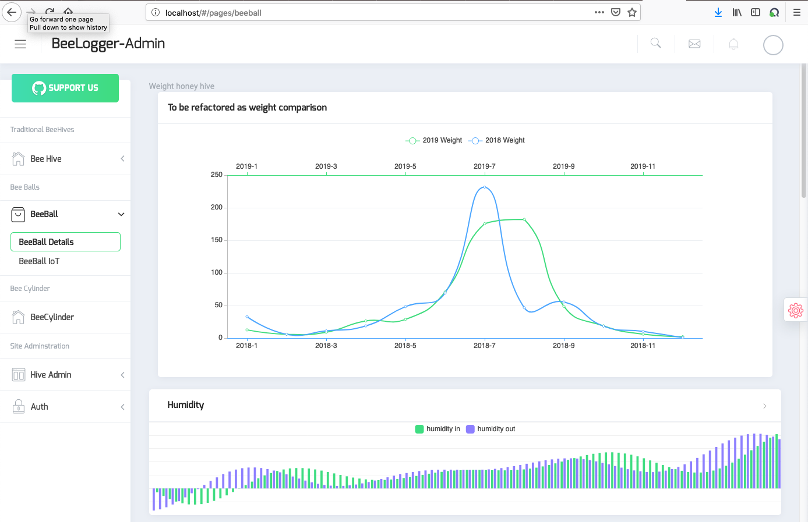
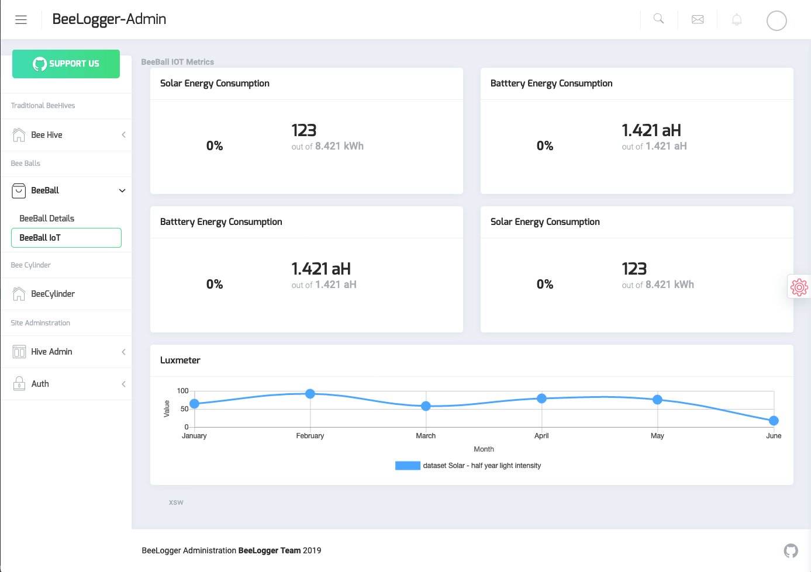

[

# Beelogger Admin </a>

### Adminstration Platform 

#### place
<a target="_blank" href="http://github.com/mschlech/beelogger-admin/" </a>

### Installation:

- install node js on your box
- Angular 7+ & Typescript
- Bootstrap 4+ & SCSS

### installation procedure for node

### check out beelogger admin

<a target="_blank" href="http://github.com/mschlech/beelogger-admin">beelogger-admin</a>

# Docker build 
The following steps should setup an easy to use Docker image. Precondition : install Docker on your host 

## to build the docker image
from the root dir of the project run the following build command.

`docker build -f src/Dockerfile -t beelogger-admin .` 

## to start the image
`docker run -d -p 80:80 --env BACKEND_API_URL=beelogger-admin --env DEFAULT_LANGUAGE=de beelogger-admin`

## the frontend

An example of hive details. it shows environmental sensor metrics. 
 

The follwoing example shows the sensor metrics which belongs to the IoT device, like energy consumption and such

# Test

# the whole plattform

- [beelogger iot arduino stack](https://github.com/mschlech/beelogger-iot-arduino) - the firmware to be deployed on the arduino
- [beelogger REST API Backend](https://github.com/mschlech/beelogger-rest-api) - the api backend 
- [beelogger eai gatway](https://github.com/mschlech/beelogger-gateway)
### base idea?
- Beelogger IOT based on the beelogger.de project [beelogger.de](http://beelogger.de)
